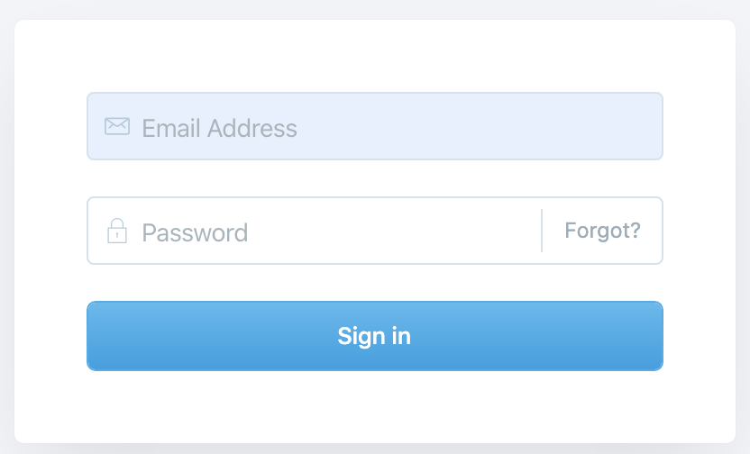

# Docker Image Ghost

A docker-compose based image of ghost that uses only local data.

- [Running locally](#running-locally)
- [Directory structure](#directory-structure)
- [Configuration](#configuration)
  - [Configuration in `docker-compose.yaml`](#configuration-in--docker-composeyaml-)
  - [Configuring nginx](#configuring-nginx)
  - [Setting the URL](#setting-the-url)
  - [Creating certificates](#creating-certificates)
  - [Setting up member management](#setting-up-member-management)
- [Reading / Sources](#reading---sources)
- [Solved problems](#solved-problems)
  - [Setting up email with gmail](#setting-up-email-with-gmail)

## Running locally

To run your local ghost as docker-compose network:

```shell
git clone git@bitbucket.org:tgartner/ghost.docker.image.git
cd ghost.docker.image
```

Then you need to set some variables (local secrets) as follows:

```shell
cp sample.env .env
```

Then edit your `.env` file (it's self explaining). Then start your environment:

```shell
docker-compose up
```

Go to [http://localhost](http://localhost) and enjoy your local ghost setup.

## Directory structure

The basic idea of this setup is to have all the ghost data in one directory and it's sub-directories. The overall structure with relevant files is as follows:

```shell
.
├── docker-compose.yaml
├── ghost_content # Written and managed by ghost
│   ├── apps
│   ├── data
│   ├── images
│   ├── logs
│   ├── settings
│   └── themes
├── ghost_logs # All logs of the ghost app
├── ghost_mysql # The database used by ghost
├── nginx_conf # Nginx configuration files
│   ├── mime.types
│   ├── nginx.conf
│   └── proxy.conf
├── nginx_logs # All Nginx logs
├── readme.md
└── sample.env
└── .env # The secrets of yours, like gmail password
```

## Configuration

Besides the secrets you entered in the `.env` file, there are a couple of further configuration options you have:

### Configuration in `docker-compose.yaml`

The first place you should check for configuration options is the `docker-compose.yaml` file. Most of the options are self-explaining. Some notes about those options:

**Ghost image**: The version is set thru the image:

```yaml
ghost:
  image: ghost:latest
```

The `latest` option might make sense for a test and development environment, but when using in production you might want to _freeze_ it to a version you tested... At the time of writing I froze my versions to `3.8` or `3.8-alpine`. For available versions of the official docker ghost image see [here](https://hub.docker.com/_/ghost).

**`environment` variables**: The variable set within this section are passed on as configuration to the standard ghost docker image. For example the variable `database__connection__user` will be set in the ghost configuration JSON file. Find details about the configuration options in the [ghost documentation](https://ghost.org/docs/concepts/config/).

**Email configuration** As I wanted to use Google Mail (aka gmail) for sending emails, it took me some time to get all the configurations right. Besides the correct entries in the configuration and their naming, the critical part was how to make it work with Google's current security setup. The crucial part was that you need a special _App Password_:

- you need to set your Gmail acount to [2-Step Verification](https://www.google.com/landing/2step/).
- And since the ghost app connects just with email & password (which is considered insecure), you need to use an [_App Password_](https://support.google.com/accounts/answer/185833?hl=en).

### Configuring nginx

Nginx is the reverse proxy sitting in front of the ghost container. It is configured by files that are located within `./nginx_conf/`. Have a look at them, most is easy to understand. `nginx.conf` is the main config file, it _includes_ the mime types and the `proxy.conf`.

### Setting the URL

The URL of your site is kind of important 😀. In the original setup it is set to `localhost`. To set it to a _real_ website name, you need to change it both, in the `docker-compose.yaml` as ghost variable **and** in the `nginx.conf` file.

### Setting up email with gmail

This was a painful process... The final solution for me was the comment of John in [this thread](https://forum.ghost.org/t/gmail-email-problem-configuration/10421)

In short, these are the steps:

- Make sure your email account has two-step-verification switched on [as described here](https://support.google.com/accounts/answer/185839?hl=en&co=GENIE.Platform=Desktop)
- Create an _App Password_ for Ghost (as an unsecure application) [as described here](https://support.google.com/mail/answer/185833?hl=en)
- Set the Account data and App Password in your `.env` file and reference to it from within the `docker-compose.yaml` file.

### Setting up member management

If you want to have content that is available only to certain readers, you need to set up members. These are the steps to take:

- Use a members enabled theme. Ghost offer the Open Source theme [Lyra](https://github.com/TryGhost/Lyra). It actually looks like Casper, but with members management.
- In the admin page go to Labs and switch members on
- Make sure your email is properly set up. For Gmail as email follow [this guide](https://www.qoncious.com/questions/how-setup-ghost-send-email-using-gmail)

#### Users and members

A finding while working with this setup: You need to be careful and make a distinction between _Users_ and _Members_:

- _Users_ are the ones that create content and administer the website.
- _Members_ are the ones that get access to non-public content.

For some time I was confused about this distinction, because I worked with email addresses that were in both roles. This is perfectly possible and works good, you just need to keep in mind for what reason a mail gets sent or a person can or cannot read non-public content.

To check, test and understand the differences:

- Setup a member-enabled ghost server, i.e. `http://myghost.com`
- Let's create a user, say user1@gmail.com
- Let's create a member, say member1@gmail.com

Now we can test the following scenarios:

- You can log in to http://myghost.com/ghost (the admin-side of the site) as user1@gmail.com. This login is done via a user/password dialog: 
- Try to create a blog post when logged in as this user. Make sure the `Post access` field is set to `Members only`.
  **Question**: Is it really `Member only` or should it be `Paid-member only`.
- You **cannot** login to http://myghost.com/ghost as member1@gmail.com.
  **Note**: If you go thru the pasword-forgotten-process with the email address member1@gmail.com, Ghost will not tell you that the user email doesn't exist - this is for security reasons.
- When going on http://myghost.com without being logged in (i.e. in a private browser tab), you will not see the private post.
  Note: You might see a teaser of the non-private posts, even when not being logged in. In case your (test-) post is very short, the teaser might look the same as the entire post... 😀.
- If on the home page you click on `Log in` you **can** log in as user1@gmail.com, you **cannot** log in as member1@gmail.com

#### Hide non-public posts

The standard theme one would probably use when switching on the member feature in ghost is [Lyra](https://github.com/TryGhost/Lyra): It's the default, free theme that supports memberships. It looks pretty similar to the default Ghost theme [Casper](https://github.com/TryGhost/Casper).

I was a little bit surpised to see that non public posts are visible on the home page, even when not being a logged in member. After investigation I understood that the blogs were only visible on the home page as teaser. This means only the abstract was displayed. When testing this with very short sample blog entries, the entire blog might be rendered...

## To do

Thingson my to do list:

- Make the setup use HTTPS, thus dealing with the certificates...
- Have a backup
- Add a discourse to the setup so we have comments like [here](https://ghost.org/integrations/discourse/)
- Add [mail2ghost2mail](https://github.com/tillg/mail2ghost2mail) so posts can be created by emails and emails can be sent when posts are published.

## Reading / Sources / Tech background

### Reading

- [How to Install Ghost CMS with Docker Compose on Ubuntu 18.04](https://www.linode.com/docs/websites/cms/how-to-install-ghost-cms-with-docker-compose-on-ubuntu-18-04/)

### Why the URL is in the `.env` file

You might wonder why the URL of our blog is stored in the `.env` file, as this isn't really a secret... 😀

The reason is a more comfortable way of working with different environments: As the `.env` file is local and specific to every environment, we can have a different URL in different environments. The typical setup would be to have the `SERVER_URL` set to the _real_ URL on the server and to `localhost` on your dev machine. So you can use the same configurations, except the URL...
